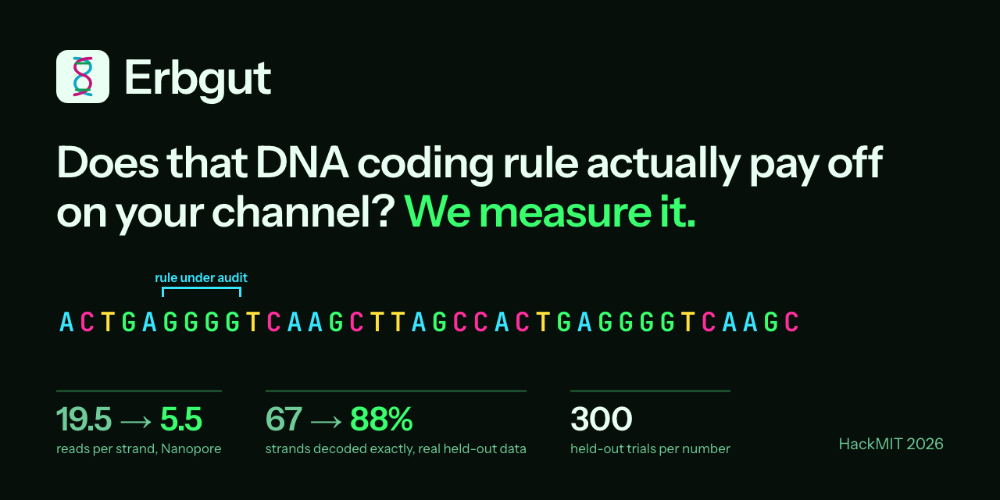

# Erbgut



**[Live site](https://timarnoldev.github.io/hackmit2026/)** · [pitch deck](https://timarnoldev.github.io/hackmit2026/deck/)

**HackMIT 2026.** We built a tool that measures whether a DNA coding rule actually pays off on your channel, and tunes the codec accordingly.

DNA storage pipelines follow hand-written rules such as "never more than 3 identical letters in a row" and "keep GC content between 40 and 60%", plus a fixed amount of redundancy. These rules are chosen once, copied between papers, and applied to every sequencing channel. Nobody measures whether they pay off.

For a given channel (sequencing technology, read budget, recovery target), our tool

1. **audits every rule and the redundancy level**: switches each rule on and off, measures what it costs and what it buys, and keeps only what pays off, and
2. **learns what to avoid from decoder failures**: a risk model trained on where the decoder actually fails picks the safest candidate strands, going beyond the hand rules where the channel has patterns they don't cover.

The result is a codec tuned to that channel that reaches the same recovery target with fewer reads per strand or less redundancy than the hand-tuned default, with the **same** encoder and the **same** decoder.

---

## Contents

**Where we stand against published work:** [docs/COMPARISON.md](docs/COMPARISON.md), written to be unflattering where the numbers are.

**Reproduce the headline numbers in one command:** `scripts/reproduce.sh` (decoder against the classic baseline on real held-out reads, plus the end to end demo). Every number we quote, with its provenance: [docs/NUMBERS.md](docs/NUMBERS.md), which is the registry the rest of the documentation points at.

**What the model learned, in its own words:** [docs/LEARNED_RULES.md](docs/LEARNED_RULES.md). It finds the homopolymer rule by itself, moves its threshold, discards the GC rule, and ranks patterns by how much they hurt the decoder rather than by how often they go wrong.

**Deep dives:** [docs/MODELS.md](docs/MODELS.md) (what the two AI models output and how they're trained) and [docs/ERRORS.md](docs/ERRORS.md) (how the error engine simulates sequencing and how the correction chain recovers files).


- [Why](#why)
- [The idea](#the-idea)
- [How it works](#how-it-works)
- [What's new](#whats-new)
- [Status](#status)
- [Getting started](#getting-started)
- [Repository layout](#repository-layout)
- [Data](#data)
- [Situation profiles](#situation-profiles)
- [Evaluation and honesty rules](#evaluation-and-honesty-rules)
- [Development workflow](#development-workflow)
- [DNA storage in 60 seconds](#dna-storage-in-60-seconds)
- [References](#references)

---

## Why

DNA stores data at extreme density and lasts for centuries, but it's a very noisy medium. Writing (synthesis) and reading (sequencing) introduce errors: wrong letters, extra letters, missing letters, and entire strands that get lost.

Which errors dominate depends on the situation:

| Situation | Dominant problem |
|---|---|
| Nanopore sequencing | Many insertions and deletions, especially in runs of the same letter |
| Illumina sequencing | Few errors, mostly single wrong letters |
| Long-term storage | DNA degrades, more strands are lost entirely |
| Tight reading budget | Few noisy copies per strand to reconstruct from |

Practical pipelines fix their sequence rules ("avoid long runs of the same letter", "keep GC content near 50%") and their redundancy by hand, and train decoders once. Adaptive constrained coding, learned decoders and end-to-end learned codes all exist, but they tune the rules, the redundancy or the decoder in isolation. Standard practice doesn't measure, on a given channel, which rules and how much redundancy actually buy fewer decoding failures.

An engineer who wants to archive data in DNA has no tool that answers:

> *"Given my budget, my sequencing technology, and how long I need to store the data, which encoding and how much redundancy should I use?"*

## The idea

Instead of deciding in advance which DNA sequences are dangerous, let decoding failures tell the encoder what to avoid, separately for each channel. A rule, or an extra strand of redundancy, is only kept when it measurably reduces decoding failure there.

The loop alternates and freezes instead of co-training, so the risk model never learns from a decoder that changes under it:

```
               Situation profile + read budget B + recovery target
                                      │
                                      ▼
  ┌────────────────────────────────────────────────────────────────────┐
  │ 1. Adapt the decoder to this channel, then freeze it               │
  │ 2. Label strands: simulate each K times, measure failure rate      │
  │ 3. Train the risk model on those labels                            │
  │ 4. Grid search settings with the risk-scored encoder; keep the     │
  │    cheapest point that meets the recovery target (train seeds)     │
  │ 5. Re-adapt the decoder to the strands the new encoder produces    │
  └────────────────────────────────────────────────────────────────────┘
                 steps 2 to 5 run at most twice more
                                      │
                                      ▼
        Tailored codec = risk model + settings + decoder weights
        evaluated once on held-out seeds, reported on the Pareto plot
```

**Where the gain comes from.** A Fountain encoder tries many candidate seeds per strand anyway, so picking the safest one costs no density. Safer strands fail less often, which turns into fewer reads per strand at the recovery target, or less redundancy (more bits per base) at the same coverage. We don't claim large density gains from dropping rules alone, because in a Fountain code they are nearly free.

## How it works

### Components

| Component | What it does | Module |
|---|---|---|
| **Channel simulator** | Turns strands into clusters of noisy reads for a situation: substitutions, insertions, deletions, run-length, 5-mer context and position effects, read quality spread, malformed reads, dropouts, uneven coverage. Calibrated on real sequencing data | `dnacodec/simulator.py` |
| **Simulator B** | Structurally different channel with perturbed rates and a context table fit on another dataset. Used only for the firewall test, never for optimization | `dnacodec/simulator_b.py` |
| **Encoder** | DNA Fountain style LT code. For each strand it generates several candidates, rejects those that break hard constraints, and keeps the one the scorer rates safest. A checksum per strand lets recovery discard corrupted strands | `dnacodec/encoder.py` |
| **Baseline decoder** | Classic alignment plus majority vote. Reported next to every model result | `dnacodec/baseline.py` |
| **Polisher (learned decoder)** | Corrects the baseline's draft with a small 1D CNN over the vote columns. Beats the baseline by 15 points at 6 reads on real held-out data | `dnacodec/model/polish.py` |
| **Risk model** | Small CNN predicting each strand's failure rate in a given situation, trained on controlled sequences labeled by K simulations each. Works on top of the audited hand rules and catches patterns they don't cover | `dnacodec/risk.py` |
| **Loop** | Alternating loop with a plain grid search over redundancy, strand length, which rules are on, and the risk threshold. Writes results after every alternation | `dnacodec/loop.py` |
| **Experiments** | Rule audit, ablation ladder A to E, crossover matrix, sim-to-real firewall, candidate examples | `scripts/run_experiments.py` |
| **Evaluation** | The only place metrics are computed, including trial-based file recovery and fewest reads at the recovery target | `dnacodec/evaluate.py` |
| **Dashboard** | Streamlit app showing the rule audit, the Pareto plot, crossover, ablation, learned patterns, accuracy vs coverage, and cost | `dashboard/` |

### Why the encoder isn't a neural network

A fully learned encoder (an autoencoder trained through the channel) sounds appealing, but insertions and deletions are hard to differentiate through, and storage needs every bit back, not "mostly right". We keep a classic fountain code at the core, which guarantees exact recovery once enough strands survive, and let AI decide which candidate strands to use. DNA Fountain already generates and screens candidates with hand-written rules. We audit those rules per channel and add a learned, situation-specific risk model on top.

## What's new

| Existing work | What we add |
|---|---|
| One fixed codec for every situation | A codec tuned per situation |
| Hand-written rules applied to every channel | Each rule audited per channel, plus a learned risk model trained on actual decoder failures |
| AI decoders trained once | A decoder fine-tuned to the specific channel |
| Encoder and decoder designed separately | Encoder and decoder adapting to each other in an alternating loop |
| Papers with fixed parameters | An interactive tool for an engineer's real constraints |

We compete at the **system level**: how an existing codec should be configured for one channel. Our opponent is the hand-tuned default practitioners use, not other papers' components. We don't claim a better encoder than DNA Fountain (ours is a standard Fountain code on purpose) or a better decoder than DNAformer, and the encoder is not a neural network.

The claim has two tiers:

| Tier | Claim | Status |
|---|---|---|
| **1. Rule audit** | Measured per channel, some standard rules and redundancy levels don't pay off; tuning them reaches the recovery target more cheaply | Holds regardless of what the risk model learns |
| **2. Learned selection** | Decoder failures teach the encoder to avoid patterns the hand rules don't cover | First evidence from real reads says the channel has such patterns (below) |

**Evidence for tier 2.** On real Nanopore reads, errors shared by all reads of a strand (the ones more reads can't fix) are largely predictable from the local 5-letter context: it explains 45 to 66% of their variance on held-apart data and predicts error hot spots with AUC 0.80 to 0.90, with the same context families leading in two independent datasets. The hand rules don't cover these contexts.

**Objective, fixed before any run:** a fixed 20 KB test file must be recovered exactly in all 300 held-out trials. At that target we measure the fewest reads per strand needed and the most bits per base achievable, and judge codecs on the Pareto front of the two. The default we compare against always uses the same decoder.

**Evidence:** a rule audit table (each rule, each channel: pays off or not), an ablation ladder (fixed codec with the baseline decoder, fixed codec with the learned decoder, audited rules and tuned redundancy, plus the learned scorer, full loop), a crossover matrix (each tailored codec on its own and the other channel), and a sim-to-real firewall (a structurally different Simulator B, plus the risk model's ranking on real reads). See [PROJECT.md](PROJECT.md).

## Status

| Part | State |
|---|---|
| Shared types, profiles, seeds, result format | Done |
| Real data loaders (Microsoft, DNAformer) with fixed held-out split | Done |
| Channel simulator | Calibrated on real Nanopore and Illumina reads, including 5-mer context errors; Simulator B for the firewall |
| Fountain encoder (LT, CRC-16 per strand, risk threshold) | Done |
| Baseline decoder and evaluation | Done |
| Decoder: learned polisher (CNN correcting the classic draft) | Trained; 82.3% against 67.2% exact strands at 6 reads on real held-out data |
| From-scratch transformer decoder | Built, lost to the baseline, not used. The measurement is in [docs/MODELS.md](docs/MODELS.md) section 3 |
| Risk model (controlled strands, failure-rate labels, CNN) | Done |
| Alternating loop and evidence experiments | Done; five runs on the GX10, listed in [docs/NUMBERS.md](docs/NUMBERS.md) section 9 |
| Dashboard (rule audit, Pareto, crossover, ablation A to E, learned patterns) | Done |

`results/mock/` holds generated fixtures for dashboard development. They are written with
`is_mock=True` and the dashboard shows a MOCK banner for them.

### Baseline on real data

Majority vote baseline on the real Microsoft Nanopore **held-out** split (2,000 clusters, strands of 110 bases). Clusters are subsampled to a maximum number of reads; the decoder uses at most 16.

| Max reads | Reads per strand | Exact strands | Mean edit distance |
|---|---|---|---|
| 2 | 2.0 | 4.8% | 5.86 |
| 4 | 4.0 | 39.2% | 1.61 |
| 6 | 5.9 | 68.1% | 0.68 |
| 10 | 9.7 | 85.3% | 0.32 |
| 16 | 14.4 | 90.6% | 0.21 |

This is the bar every model result is compared against. The baseline is already strong at high coverage, so the room for a learned decoder is at **low coverage (2 to 6 reads)**, which is exactly where reading gets cheap.

Reproduce with `uv run python scripts/eval_real.py`. This table is one subsample draw; the reconciled version, averaged over 20 draws with standard deviations and with the polisher next to it, is [docs/NUMBERS.md](docs/NUMBERS.md) section 1.

## Getting started

Requirements: Python 3.11+, [uv](https://docs.astral.sh/uv/), git. A CUDA GPU for full decoder training.

```bash
git clone https://github.com/timarnoldev/hackmit2026.git
cd hackmit2026

uv sync                        # core dependencies
uv sync --extra train          # + PyTorch, for the decoder, risk model, and loop
uv sync --extra dashboard      # + Streamlit, Plotly, pandas, for the dashboard

scripts/download_data.sh       # Microsoft set + small DNAformer subset (~90 MB)
scripts/download_data.sh --full   # all datasets (~1.2 GB), use on the GPU machine

uv run pytest -q               # 185 tests without the extras
uv run --extra train --extra dashboard pytest -q   # the full 260
```

Generate mock results for the dashboard:

```bash
uv run python -m scripts.make_mock_results
```

Evaluate the baseline decoder on the real held-out split:

```bash
uv run python scripts/eval_real.py
```

Launch the dashboard (falls back to mock data with a MOCK banner if no run is present):

```bash
uv sync --extra dashboard
uv run streamlit run dashboard/app.py
```

## Running on the GX10

All GPU work runs on one ASUS Ascent GX10 (NVIDIA GB10, ARM64, 128 GB unified memory, 20 cores). Details in the Compute section of [AGENTS.md](AGENTS.md).

```bash
git clone https://github.com/timarnoldev/hackmit2026.git && cd hackmit2026
uv sync --extra train
scripts/download_data.sh --full

# 1. Does PyTorch see the GPU? This is the most likely problem on ARM.
uv run python -c "import torch; print(torch.cuda.is_available(), torch.cuda.get_device_name(0))"
#    If False: uv pip install --reinstall torch --index-url https://download.pytorch.org/whl/cu130
#    and use `uv run --no-sync` afterwards. Last resort: NVIDIA's NGC PyTorch container.

# 2. Sanity checks
uv run pytest -q
uv run python -m dnacodec.model.train --smoke

# 3. Train the polisher, the decoder used in every result (about 13 minutes)
uv run --extra train python scripts/train_polish.py

# 4. Compare it against the baseline on the real held-out split
uv run python scripts/eval_real.py
uv run --extra train python -m dnacodec.model.benchmark checkpoints/polish/polish.pt --polish
```

`dnacodec/model/train.py` trains the from-scratch transformer instead. It is kept for the record
and is not used by any result; see [docs/MODELS.md](docs/MODELS.md) section 3.

### Loop and experiments

```bash
# One alternating loop per core situation (--decoder baseline | polish | transformer)
uv run python scripts/run_loop.py --profile nanopore_budget --run-id run1 --workers 7
uv run python scripts/run_loop.py --profile illumina_standard --run-id run1 --workers 7

# After both loops: rule audit, ablation A to E, crossover, firewall, candidate examples
uv run python scripts/run_experiments.py --run-id run1 --workers 14

# Quick smoke run with reduced budgets (not the objective)
uv run python scripts/run_loop.py --profile illumina_standard --run-id quick --quick
```

Results land in `results/<run_id>/` and show up in the dashboard. Which run backs which number is listed in [docs/NUMBERS.md](docs/NUMBERS.md) section 9.

## Pitch and marketing

- `marketing/deck/`: the animated web pitch deck with presenter mode (serve it, press `P`)
- `site/`: the landing page GitHub Pages publishes
- `marketing/`: brand identity (Erbgut), logo, one-pager, pitch script, Devpost text, social card

`[TEAM: ...]` marks the places still waiting on real names.

## Repository layout

```
.
├── PROJECT.md              Project brief: idea, claims, objective, evidence design, risks
├── AGENTS.md               Contributing rules: interfaces, held-out discipline, conventions
├── dnacodec/
│   ├── types.py            Shared types: Strand, Cluster, EncoderSettings, Metrics, Decoder
│   ├── profiles.py         SituationProfile: load, validate, save
│   ├── seeds.py            Train vs held-out seed discipline
│   ├── realdata.py         Loaders for real datasets and the fixed held-out split
│   ├── results.py          Result file format (the contract between loop and dashboard)
│   ├── testfile.py         The fixed 20 KB test file (never change its size or seed)
│   ├── simulator.py        Channel simulator
│   ├── simulator_b.py      Simulator B, for the firewall test only
│   ├── encoder.py          Fountain encoder, rule scorer, recovery
│   ├── baseline.py         Majority vote baseline decoder
│   ├── evaluate.py         Metrics, recovery trials, fewest reads at the target
│   ├── model/              Learned decoders: polisher, data, training, benchmark
│   ├── risk.py             Risk model
│   └── loop.py             The alternating loop
├── profiles/               Situation profiles as JSON, context/ holds the 5-mer error tables
├── docs/                   NUMBERS.md registry, COMPARISON.md, and the deep dives
├── dashboard/              Streamlit dashboard
├── scripts/                Data download, calibration, risk training, loop, experiments, evaluation, mock results
├── tests/                  pytest suite
├── data/                   Downloaded datasets (not committed)
├── checkpoints/            Model checkpoints (not committed)
└── results/                Loop output, one folder per run (not committed)
```

## Data

We use real sequencing data **and** a simulator. Real data alone can't drive the loop: every iteration produces a new encoding, and only a simulator can "read" it overnight. Real data keeps the simulator honest.

| Dataset | Platform | Content | License |
|---|---|---|---|
| [Microsoft clustered Nanopore reads](https://github.com/microsoft/clustered-nanopore-reads-dataset) | Nanopore (MinION) | 10,000 references of length 110, 269,709 reads, already clustered. Mean cluster size 27, median 21. Error rates roughly 1.7% insertions, 2.0% deletions, 2.2% substitutions | MIT |
| [DNAformer binned reads](https://zenodo.org/records/17473983) (Technion) | Nanopore (2 flowcells) and Illumina | References of length 140, clusters labeled with their reference, random and semantic files, about 1.2 GB | CC BY 4.0 |

How real data is used:

1. **Calibrate the simulator**: error rates, position dependence, homopolymer effects, and coverage are fit to real reads.
2. **Fine-tune the decoder** on real clusters after pretraining on simulated data.
3. **Validate the risk model**: its predicted risk must rank real failing strands above succeeding ones.
4. **Benchmark honestly** on held-out real clusters that no training touches.

**Caveat:** the Microsoft README (note of 8/12/2024) states that its references are not uniformly random due to a generation bug, and some clusters may be malformed. We use it for reconstruction benchmarks and calibration, and the risk model never trains on its references. The 5-mer error table fit on its reads measures the error rate *given* a context, which the skewed composition mostly makes noisier for rare contexts. Malformed clusters could still bias some contexts, which is why we cross-check: the same context families lead on DNAformer, and Simulator B uses a DNAformer table instead.

Loading:

```python
from dnacodec import realdata

train = realdata.load_microsoft("train")      # 8,000 clusters
heldout = realdata.load_microsoft("heldout")  # 2,000 clusters, evaluation only
illumina = realdata.load_dnaformer("BinnedTestIllumina_Random", "train")
```

## Situation profiles

A profile describes the storage channel in one situation. Profiles live in `profiles/*.json`.

| Field | Meaning |
|---|---|
| `technology` | `nanopore` or `illumina` |
| `sub_rate`, `ins_rate`, `del_rate` | Per-base error rates |
| `homopolymer_factor` | Error multiplier per extra base in a run of the same letter |
| `end_factor` | Error multiplier at the end of the strand vs the start |
| `dropout_rate`, `gc_dropout_factor` | Strand loss, and extra loss for unbalanced GC content |
| `coverage_mean`, `coverage_dispersion` | Reading budget in reads per strand, and how uneven it is |
| `storage_years`, `decay_per_year` | Extra strand loss from aging |
| `synthesis_usd_per_base`, `sequencing_usd_per_read` | Cost model |
| `calibrated_from` | Dataset the numbers were fit to, or `null` if estimated |
| `homopolymer_run_factors` | Optional deletion multiplier per run length, overrides `homopolymer_factor` for deletions |
| `read_quality_spread` | Spread of a per-read error multiplier (some reads are much worse than others) |
| `malformed_read_rate` | Fraction of reads that actually belong to another strand (clustering errors) |
| `position_rate_spread` | Spread of a per-position error multiplier shared by all reads of a strand, random so it carries no motif |
| `context_table` | File under `profiles/` with per-5-mer error multipliers, or `null` for no context dependence |

Current profiles:

| Profile | Situation |
|---|---|
| `nanopore_budget` | Portable Nanopore reading on a tight budget, short-term storage |
| `illumina_standard` | Lab Illumina reading, normal budget, short-term storage |
| `illumina_archive_100y` | Stretch goal. Century-scale archive read with Illumina; heavy strand loss (extrapolated, no real data exists) |

The two core situations are `nanopore_budget` and `illumina_standard`. `nanopore_budget` is calibrated on the Microsoft train split, `illumina_standard` on the DNAformer Illumina train split.

> Cost numbers are placeholders until verified and are not presented as real figures.

## Evaluation and honesty rules

Our numbers are only worth something if they're measured cleanly. These rules are enforced in code where possible:

- **Held-out seeds** (`seeds.heldout_seeds()`) and the **held-out real split** (every 5th cluster) are used only for evaluation. `seeds.train_seed()` raises an error when training code touches a held-out seed.
- **All metrics come from `dnacodec.evaluate`.** No ad-hoc accuracy calculations elsewhere.
- **The baseline is always reported** next to every model result.
- **Mock data is flagged** (`is_mock=True`) and the dashboard shows a banner for it.
- **Uncalibrated or extrapolated numbers are labeled** as such.

Metrics per evaluation: exact strand accuracy, mean edit distance, dropout rate, reads per strand, per-position error, file recovered (yes or no), net density in bits per base, and write and read cost per MB.

On top of that, `recovery_trials` runs repeated independent passes of the fixed test file through the channel, and `min_reads_at_target` finds the fewest mean reads per strand (on a fixed coverage grid) at which the recovery rate meets the target, by default every trial. These two drive the settings search (train seeds) and the final numbers (300 held-out trials per codec).

## Development workflow

The code is written largely by AI coding agents working in parallel, with humans owning interfaces, verification, and the story.

- `AGENTS.md` defines ownership per file, the hard rules, and the conventions.
- Work happens on branches in separate git worktrees. Shared interfaces (`types.py`, `seeds.py`, `results.py`) don't change without agreement.
- One person merges into `main` and runs the tests after every merge. The full pipeline must run end to end after each merge.
- Every reported number is re-checked independently before it is used, and lands in `docs/NUMBERS.md` with its provenance.

## DNA storage in 60 seconds

1. **Encode**: bits become a sequence of A, C, G, T (up to 2 bits per letter).
2. **Split into strands** of about 100 to 200 letters. Each strand carries an index, because strands are stored unordered in a tube.
3. **Synthesis**: strands are written chemically. Expensive, and introduces errors.
4. **Storage and PCR**: strands are copied many times before reading. Some get copied more, some are lost.
5. **Sequencing**: the machine returns many noisy copies ("reads") of each strand.
6. **Clustering**: reads are grouped by the strand they came from.
7. **Trace reconstruction**: each strand is recovered from its noisy copies. This is where the decoder works.
8. **Outer error correction**: the fountain code recovers the file even when strands are missing.

Glossary:

- **Coverage**: number of reads per original strand. Sequencing cost scales with it.
- **Density**: stored bits per synthesized letter (maximum 2).
- **Homopolymer**: a run of the same letter, like `AAAAAA`. Error-prone, especially on Nanopore.
- **GC content**: share of G and C letters. Extremes cause synthesis and reading problems.
- **Dropout**: a strand lost entirely.

## References

- Erlich, Zielinski. *DNA Fountain enables a robust and efficient storage architecture.* Science, 2017.
- Organick et al. *Random access in large-scale DNA data storage.* Nature Biotechnology, 2018.
- Srinivasavaradhan, Gopi, Pfister, Yekhanin. *Trellis BMA: Coded trace reconstruction on IDS channels for DNA storage.* ISIT 2021. [arXiv:2107.06440](https://arxiv.org/abs/2107.06440)
- Bar-Lev et al. *Scalable and robust DNA-based storage via coding theory and deep learning.* Nature Machine Intelligence, 2025. [Link](https://www.nature.com/articles/s42256-025-01003-z)
- Rashtchian et al. *Clustering billions of reads for DNA data storage.* NeurIPS 2017.

Datasets: [Microsoft clustered Nanopore reads](https://github.com/microsoft/clustered-nanopore-reads-dataset) (MIT), [DNAformer binned reads](https://zenodo.org/records/17473983) (CC BY 4.0).
